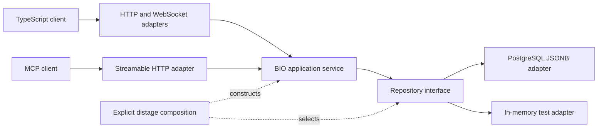

# CQ architecture

This document records the implemented foundations and the intended release boundaries. The implementation status and requirement coverage identify what has been verified.

## Dependency boundaries

`contracts` compiles Baboon-generated Scala models and codecs. `core` owns service/repository interfaces and BIO business operations. `server` contains JDBC and http4s adapters, the explicit distage plugin, and the server composition root. The TypeScript contract compiler and verification clients exercise the generated browser-facing representation. `web` contains the minimal browser. `host` contains the local isolated-workspace adapter and bounded command runner; it is not bound into server startup. The supervisor will use it in M2.

The application services depend on ledger, usage and workspace repository contracts; their implementations require BIO `Error2`. The PostgreSQL adapter uses ZIO blocking effects and lexical JDBC resource ownership. The in-memory adapter uses an injected lifecycle-scoped reference. Production and dummy bindings share a plugin and differ by `Repo` activation. Plugins are registered explicitly for JVM and native execution; runtime classpath scanning is not used to discover application plugins.

The retained M0 `probe` remains a stack proof. M1 supplies the ledger/audit services and actual clients. It uses one JSONB row per authenticated project. The runtime requires explicit database, listening, origin, credential and project configuration. HTTP, WebSocket and MCP share the same service and codecs. Signed project/role credentials and browser sessions authenticate M1 requests; separate host ingestion accounts usage.

## Durable state design for M1–M4

PostgreSQL is authoritative. Items have project identity, a fixed ledger discriminator, per-ledger atomic numeric ID, revision, archive attribute and versioned Baboon content. Each mutation checks authorization and expected revision, records history, and advances a transactional project change cursor. A request identity stores the committed acknowledgement in the same transaction. Notifications follow committed state; reconnects replay committed changes or explicitly resnapshot.

Edges are stored once in their canonical direction. Inverse reads derive from indexed canonical edges; changes record history for both endpoints. A relationship membership revision invalidates stale termination previews. Traversal and user queries always retain server-imposed project and permission scope.

Claims cover explicit item sets and carry monotonically increasing fences. Result admission checks both the current fence and frozen job membership. Isolated Git workspaces produce candidates; integration compares the target revision atomically and persists a reconciliation identity before acknowledging the ledger result.

## Process authority

The executable uses one distage `RoleAppMain` composition root for the implemented server and CLI task roles. The manual CLI branch has been removed. Role selection acquires only the selected role's resources: [actual client checks](../validation/m2-roles.md) pass with all server/database/credential configuration removed. The [local supervisor](supervisor-role.md) and injectable harness adapters share that graph; actual batch-role checks pass without local database configuration. Child control transport is still pending. Early and runtime diagnostics go to stderr, preserving command output on stdout.

The local governing wrapper owns child processes and hierarchy cancellation. The server owns durable records, artifacts and operational usage observations; it never launches harness processes. Prompt assembly and result storage occur outside the parent model. Normal parent traffic contains references and bounded summaries. Claude, Codex and Pi adapters enforce the same role contract through their own tool and configuration mechanisms.

## Usage identity

The operational usage audit is append-only and separate from all fourteen ledgers. An attempt/source identity deduplicates raw observations, including cumulative updates and resumed sessions. Corrections append records referencing earlier observations. Frozen assignment identities preserve direct task, shared cohort and unattributed scopes. Shared totals are counted once; regrouping cannot rewrite historical attribution. Missing metrics remain unknown. Evaluation reporting consumes this same log and adds outcome assessment, not another accounting store.

Ledger/explicit claims/usage and the [workspace foundation](workspaces.md) have implementation evidence. Supervisor, claim-bound result admission, full process, Git integration and later UI behavior remain in their assigned milestones; see [implementation status](../implementation-status.md).
