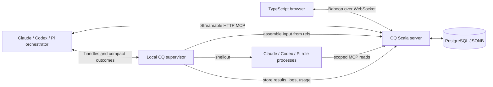

# CQ replacement: design brief

Status: requirements-stage proposal, accompanying the [requirements prompt](20260926-0957-cq-requirements-prompt.md) and [source audit](20260926-0957-existing-cq-audit.md). This document makes the proposed boundaries, role inventory, command inventory, and dispatch concrete. It does not claim that complete Baboon/JSON Schema contracts or a working implementation already exist; producing and validating those is an explicit deliverable of the prompt.

The product remains **cq**. Its new source root is the inner `./cq4` directory. The existing `./cq` and `./ponygirls` are reference inputs.

## Confirmed decisions

The user confirmed these choices during requirements development:

1. Fresh start; no old-data importer or old protocol compatibility requirement. Web UI and CLI; no TUI in the first release.
2. Adaptive cohorts group related work for shared investigation, planning, implementation, and review while retaining separate item identities. Automatic duplicate merging is not required.
3. Privilege separation prevents accidental misuse by cooperative agents. MCP permissions and harness tool restrictions are enforced; resistance to a malicious process with the user's OS privileges is outside this model.
4. Bulk termination follows derived work and milestone membership. Prerequisites and shared work remain unchanged unless explicitly selected. The preview exposes exclusions.
5. Survival of subagents across governing-harness exit is not required. Whole-hierarchy termination is acceptable when it simplifies ownership. This proposal chooses that behavior.
6. The governing session may see bounded outcome summaries and explicitly drill down. Full prompts, assembled inputs, and result bodies must not pass through its context merely to be forwarded.

Other detailed choices below are recommendations for the full design, not additional user decisions.

## Components and ownership



The server owns project identity, ledger state, revisions, relationships, queries, claims, artifacts, the usage audit log, and live changes. Both transport adapters call the same application services. It does not own checkouts, Git processes, validation commands, or harness processes.

A local supervisor owns one governing harness and its subprocess hierarchy. Prefer a `cq run <claude|codex|pi>` wrapper, integrated through ponygirls packaging, so the process relationship is explicit. Shell tools make short calls to its local control socket; the Pi extension uses the same control protocol. If a session was started without the required supervisor, dispatch reports an actionable unavailable state rather than silently changing execution policy.

The supervisor starts before the governing harness, monitors its process lifetime, and terminates remaining jobs when that harness exits. A child's timeout terminates that job's descendants only. The governing harness continues to work on other jobs. Finished results and transcripts remain in the server's artifact store after local teardown.

This adds a local process, not another project server or database. The full design must demonstrate that the wrapper works with the pinned harnesses and existing sandbox packaging. Prefer one supervision implementation to three separate deadline/cancellation implementations.

Scala services use BIO, explicit typed errors, distage constructor injection, and lifecycle-managed resources. Keep the server and supervisor dependency graphs distinct even if they ship in the same binary as separate roles. Static plugin registration is required for native-image. Keep pure policy, PostgreSQL access, HTTP/WebSocket/MCP adapters, local process control, and UI state behind small named boundaries.

## Ledger model

Preserve the 14 fixed ledgers and prefixes discovered in the audit. No runtime schema registry, custom ledger creation, or special ledger for this rewrite.

Proposed common record:

```text
Item = identity + revision + content + refs + archive flag + server timestamps
identity = immutable project identity + ledger kind + allocated item number
content = a closed sum of the fourteen ledger-specific content types
revision metadata = authenticated actor + session/run identity + optional declared model
```

Use a common `title` and Markdown `body` where that removes incidental differences between headline/title/summary. Keep genuinely different fields typed. The full design must decide exact optionality and statuses for every row below; unrestricted JSON property bags are not a substitute.

| Ledger | Specific content to retain |
|---|---|
| ideas | Proposed outcome and motivation |
| defects | Severity, observed/expected behavior, reproduction, cause and resolution evidence |
| goals | Intended outcome, acceptance criteria, scope |
| milestones | Title and description of a grouping |
| tasks | Acceptance criteria, implementation result and validation evidence |
| researches | Empirical question, findings, conclusion and recommendation |
| hypothesis | Claim, rationale, evidence and adjudication |
| questions | Question, context, alternatives and user answer |
| decisions | Choice, rationale and alternatives |
| reviews | Subject revisions or candidate commit, verdict and findings |
| handoffs | Outcome, remaining work and blocking reasons |
| operatorActions | Required action, expected evidence, observed evidence and outcome |
| memories | Retained knowledge, applicability and evidence |
| upstream | External component/version, reproduction, report location and upstream outcome |

An idea or defect can be created with no milestone. Goals arise from intake; goals produce work and artifacts. Milestones group tasks and process artifacts. There is no ambient milestone and no milestone ownership of ideas, defects, or goals. Shared memories and upstream records can remain independent.

Statuses describe records; they do not encode an enforced sequence of agent operations. Every schema-valid status change, correction, and reopening is permitted for an authorized writer with the appropriate concurrency preconditions. Terminal status and dependency satisfaction remain separate concepts: an abandoned task does not satisfy work that needed its result.

Readiness is a derived scheduling view with reasons. A missing review, unanswered question, or unsatisfied dependency can make work unready for automatic execution without preventing a human or authorized agent from correcting its record. Only data validity, permissions, current revisions, work claims, and transactional consistency are hard admission conditions.

## Relationships and graph selection

Use one `refs` vocabulary for all ledger-to-ledger relationships. Candidate relations are:

| Relation | Inverse | Meaning |
|---|---|---|
| derived-from | produces | Work or artifact produced from another item |
| part-of | contains | Process artifact assigned to a milestone |
| blocked-by | blocks | Prerequisite for automatic readiness |
| reviews | reviewed-by | Review subject |
| supports | supported-by | Evidence relationship |
| contradicts | contradicted-by | Contrary evidence |
| supersedes | superseded-by | Replacement without deleting history |
| relates-to | relates-to | Symmetric context |

The full design must give an endpoint-type/cardinality table, cycle policy, and traversal policy for each relation. In particular, dependency edges and derivation edges must not silently become interchangeable. Milestone membership allows only the agreed process artifact kinds and at most one milestone per member in this proposal.

Store **one canonical edge** and derive its inverse when reading. Adding `T42 blocked-by D534` therefore exposes `D534 blocks T42` without two independently mutable copies. Mutations from either orientation normalize to the same edge. Duplicate addition is idempotent; deletion removes both views transactionally. Reject unresolved item references and cross-project edges in the first release.

An edge mutation must be visible in the histories of both affected items. The full design must choose either full revision snapshots including incident refs or immutable edge revisions with an unambiguous as-of reconstruction. Current edges alone cannot reconstruct old item versions. File paths, external URLs, and log artifacts are typed citations/attachments; they must not introduce a second competing ledger-item relationship graph.

Worksets are values: an explicit root list supplied by a user/session, optionally remembered in local configuration. A graph request returns actionable descendants separately from context such as prerequisites, reviews, and associated milestones. Context inclusion neither grants write permission nor makes an item scheduled work. Following an item's milestone for context must not pull every sibling task into the workset. Empty roots mean an empty workset; all-project selection is explicit.

The server can enumerate ready subgraphs from those roots. The graph is not persisted as item fields and does not become a provenance or authorization protocol. Results are bounded and paginated with an explicit incomplete state when limits prevent complete traversal.

## Concurrency, history, and bounded storage

Use PostgreSQL JSONB for typed content, relational columns for project/kind/number/revision/archive metadata, and an indexed edge table. Neither a JSONB document containing a whole project nor an in-memory project mirror should be required for an ordinary mutation.

Counters are atomic per `(project, ledger)` and allocate all externally visible item IDs. Callers cannot supply item numbers. IDs are immutable and never reused; gaplessness is not required. Retries of the same creation request return the same allocated ID. Revisions, item numbers, fence values, and change cursors need exact 64-bit handling across Scala and TypeScript.

Every successful mutation atomically writes current state, immutable history, affected edges, the idempotency outcome, and a durable change record. Include creation, edits, relationship edits, archiving, unarchiving, and bulk changes. Failed transactions leave none of these partially committed. Restoring an old revision creates a new revision. Historical data retains the schema version needed to decode it.

Combine optimistic revision checks with server-supported **work claims**. Revision checks prevent lost writes; claims stop two sessions from starting the same work. Database transaction locks alone do not provide a useful hours-long ownership contract.

Recommended claim semantics:

- Atomic acquisition of an explicit item set; all-or-none on conflict, with deterministic lock order.
- Owner identity, expiration, renew/release, and a monotonically increasing fence per claimed item.
- Server time for expiration; a stale owner cannot mutate or finalize after expiry or takeover.
- Claims for planning/intake cover the producer being expanded, preventing concurrent duplicate goal/task generation by cooperating sessions. After acquiring a claim, re-read its current derived work before creating more.
- Agent state mutations use valid claims; brief UI edits can obtain a short claim in the mutation transaction. Editing a claimed item exposes the owner and conflict. A deliberate takeover records its actor and reason.
- Relationship maintenance may update inverse views without treating a referenced prerequisite as assigned work. Specify its revision/conflict behavior explicitly.
- Claims belong to the governing session/work group and remain held across worker, reviewer, and integration steps. The supervisor renews them until release or the group's deadline. Losing renewal stops acceptance and triggers cancellation within a declared bound. Leases never make an old process safe to reuse: its worktree stays isolated and quarantined until termination is confirmed.

The server cannot atomically fence arbitrary shell/Git effects. Distinct editing jobs get distinct worktrees; the local supervisor checks ownership before accepting a result or integrating a candidate. Reused PIDs, an unkillable descendant, and uncertain process exit must be observable outcomes. Do not release/reuse a worktree because a JavaScript promise timed out.

Integration needs its own concurrency boundary: two sessions with valid claims for different tasks can still target the same branch. Require an isolated integration workspace, an expected target revision, and a conditional atomic target update or equivalent serialization that prevents both lost updates and shared checkout/index interference. An item claim or expiring lease alone cannot fence a stale Git writer. If the target advances, construct the new combined candidate and determine which checks and reviews remain applicable; rerun those invalidated by the changed candidate before attempting integration again. Prior approval of one candidate must not silently approve a different combined result.

Git and PostgreSQL do not share a transaction. Retain enough operation identity and expected/observed target state to reconcile successful integration after a failed or uncertain ledger acknowledgement. Do not blindly repeat an integration effect or mark it recorded without checking its outcome. The full design must give a bounded reconciliation path and an acceptance scenario with two independently claimed tasks integrating concurrently, including target advancement and Git success followed by ledger failure. A small operation record should satisfy this requirement without restoring the old attestation protocol.

Mutation cost must scale with the changed item, incident refs, and explicitly requested closure, not unrelated project size. Use row-local FTS maintenance and indexes on scoped scalar filters and both edge directions. Bulk operations and explicit migrations are allowed to visit their whole declared target set. Pagination and result limits must not disguise an unbounded internal scan.

## Search, archive, and termination

One query grammar serves MCP, CLI, and UI. It supports text/phrases, exact item IDs, ledger/status/tag/project attributes, archived state, and typed relationship filters. Prefer explicit `AND`, `OR`, `NOT`, parentheses, and defined implicit conjunction. Publish grammar, precedence, escaping, allowed attributes, error spans, and normalized examples. Compile an AST to parameterized SQL; never concatenate user text into SQL.

Make project scope explicit outside the query and intersect it with authenticated access. Queries cannot override that boundary. Bare `T42` is local to a selected project. Define pagination order and what happens if the query's result changes between pages. Give exact-count queries a distinct cost from cheap page reads.

Archiving is an ordinary editable attribute. Default searches exclude archived records; explicit query syntax includes or selects them. Fetch-by-ID, history, and references can still resolve archived items. No archive table, archive MCP family, archive-only UI mode, or automatic status rewrite is needed.

Bulk termination has preview and apply operations on the same tool. Its request supplies roots and a terminal intention. The preview freezes the exact changes and exclusions. Apply verifies the preview's item revisions and relevant graph membership, including newly attached descendants, then commits the entire approved set or nothing.

Traversal follows produced work and milestone members only. It does not traverse prerequisite/context edges. Shared descendants with producers outside the selected closure are excluded until explicitly selected. Associated milestones encountered for context do not pull unrelated members into termination. Existing terminal factual artifacts are preserved by default. The full design must specify terminal-intent mappings for every ledger and reject ambiguous mappings; completing a subtree must not silently manufacture a confirmed hypothesis, an approved review, or a verified operator action.

The preview includes affected IDs, old/new states, shared exclusions, active claims/jobs, and effects on readiness. It never truncates silently. Stale previews require a new preview. Cancelling running work requires supervisor settlement or fencing before its stale result could be accepted; the server itself never signals OS processes.

## Adaptive cohorts

Cohorts are execution groupings of individually identified work, not a new ledger, permanent ownership field, or item merger. They apply to investigation, planning, implementation, and review where shared effort is useful.

The process proposes groups from bounded workset candidates and observed context. The server validates scope, item revisions, claims, phase compatibility, and dependencies. Grouping can use shared requirements, causes, affected components, and validation work; a TypeScript import graph or a CQ-specific command is not an eligibility requirement.

Freeze membership while a job runs. Retain the execution identity and that membership snapshot for historical usage attribution; this does not create permanent item ownership. Reconsider grouping between rounds when evidence changes. Split on incompatible acceptance criteria, divergent causes, excessive context, a blocked member, conflicting edit scope, or repeated failure to progress. An explicit singleton with a reason is a valid result of the grouping policy. Pairwise overlap is not proof that every member can share one correction.

A shared candidate/review still carries an outcome for **every** member. A cohort's green check does not automatically mark every task done. Claim the whole scheduled group atomically. Return unexamined candidate counts so batching does not pretend to have considered the entire project. Start with a simple observable heuristic; learned policies or language-specific plugins need demonstrated benefit before becoming requirements.

## Proposed subagents: four roles

| New role | Replaces | Capability boundary | Stored result |
|---|---|---|---|
| **explorer** | investigate-explorer, research-explorer | Read source and scoped CQ context; no arbitrary command execution or writes | Evidence, candidate explanations, uncertainties, requested probes |
| **planner** | plan-advance | Read context; no source edits or ledger mutation | Proposed goals/tasks/research/questions/decisions and relations |
| **worker** | implement-worker, investigate-prober, research-experimenter, implement-conflict-resolver | Execute in an assigned isolated workspace; mode constrains implement/probe/resolve scope | Candidate/probe artifacts, observed checks, per-member outcomes |
| **reviewer** | plan-reviewer, implement-reviewer, implementation-auditor | Read the selected plan or exact candidate; run declared checks where required; no candidate edits | Verdict, per-member findings, evidence, proposed follow-up |

Modes are typed inputs to these four roles, not independently evolving copies of the entire prompt. A probe gets a disposable workspace and probe-specific output; a conflict resolution job gets a supplied conflict state; neither inherits permission to rewrite the plan or publish code. Review authorship remains independent of worker authorship when the process calls for independent review.

The governing session owns process selection, user interaction, claims, recording accepted proposals, and integration. It is not a fifth dispatched role. Subagents cannot recursively dispatch by default and cannot mutate ledger domain records. They receive input through the host and return typed artifacts through the host. Their MCP connections expose only the reads needed for their assignment; server authorization also checks attempted direct calls.

The full design must provide the exact input/output schema, available tools, permitted MCP operations, model selection, failure results, and prompt asset for each role/mode/harness combination. Combining role names must not combine incompatible privileges.

## Proposed commands

Four user-facing agent commands preserve the useful workflow entry points:

| Command concept | Behavior | Old commands absorbed |
|---|---|---|
| **begin** | Capture new intent or attach a scope change to existing work; clarify genuine user choices | begin, plan/follow-up |
| **advance** | Advance selected roots through ready investigation, planning, research, implementation, and review; continue independent work | advance, investigate, investigate/advance, plan, plan/advance, research, research/advance, implement/start, implement/advance |
| **review** | Request a review of specified plan revisions or a candidate; record actionable findings | plan-review, implement-review |
| **upstream** | Prepare/report/recheck external dependency defects according to the user's requested action | upstream |

`planners` and `reviewers` become configuration/catalog information, available through the ordinary context/status interface. Phase limits and selected roots are arguments to `advance`, not a family of copy-pasted commands. The real process stops on no actionable work, required user input, cancellation, or a surfaced execution failure; one blocked group does not stop independent work.

Claude and Pi can render these as `/cq:begin`, `/cq:advance`, `/cq:review`, `/cq:upstream`. Codex uses generated `cq-begin`, `cq-advance`, `cq-review`, `cq-upstream` skills. One source owns semantic instructions; adapters own invocation vocabulary and tool names.

Administrative CLI operations are separate from LLM workflows: `cq init`, `cq serve`, `cq web`, `cq run <harness>`, `cq status`, `cq query`, and `cq job status|cancel`. Put usage summaries and paginated audit inspection under `cq status`, with an explicit task/cohort/session/project scope. Project identity changes and artifact inspection can be subcommands of the relevant administrative groups. Specify the final CLI inventory in the full design; do not create a command for every ledger transition.

## Token-saving dispatch

The parent should request work in roughly this shape (illustrative JSON, not a finalized schema):

```json
{
  "operation": "start",
  "requestId": "opaque-idempotency-key",
  "role": "worker",
  "mode": "implement",
  "items": [{"id": "T42", "revision": "7"}],
  "priorResult": null,
  "guidanceRefs": ["Q8"],
  "timeoutMs": 600000
}
```

Project/session/claim context comes from the authenticated host session. Role configuration chooses a harness/model; an explicit named configured override is allowed. The request has no prompt, copied task body, copied criticism array, output schema, or raw transcript. Input schema limits must make this a contract, not merely a prompt convention.

1. **Resolve.** Host code loads the installed role asset, selects the harness adapter, reads specified ledger revisions and evidence, resolves guidance references, and validates the typed input. A request ID identifies one launch attempt; repeating it cannot start another child.
2. **Prepare.** The host assembles the complete child prompt/input outside the parent context. It creates the scoped MCP credential, workspace, input artifact, and bounded job record. Prompt identity/model/harness are audit metadata, not a chain of approval capabilities.
3. **Launch.** The supervisor starts the shellout, continuously drains stdout/stderr, and responds promptly with a job handle. Launch timeout, total execution deadline, and cancellation grace are independent. Polling has a bounded wait and never waits for EOF forever.
4. **Store.** The adapter parses the child's typed final result, validates shape and declared scope, and stores immutable results and transcripts. Shell exit, structured-result validity, observed validation results, and semantic acceptance remain separate facts. A plausible final sentence is not successful process completion.
5. **Summarize.** Return a bounded projection: job state, role, affected IDs, per-member outcome counts, next-action code, short blocker, and artifact handles. Long findings, plans, patches, and logs stay in artifacts. Essential blockers cannot disappear through truncation: return counts and explicit drill-down handles.
6. **Chain.** A reviewer or correction worker takes the preceding result handle. Host code resolves its content directly. The parent never reads it just to paste it into another dispatch. Semantic drill-down is explicit, sectioned, and bounded.
7. **Apply.** Planner/reviewer results may contain proposed typed ledger changes. The parent can preview/apply a stored proposal by handle after inspecting its compact semantic summary. The server checks allowed changes, current revisions, scope, and claims; a result is not authority to mutate. Replaying an accepted proposal returns the original mutation result. New entities receive server IDs in the application transaction.

Stored output is repeatably readable. Avoid the old one-shot materialization constraint: retries, compaction, and harness restarts should not lose a completed result because it was once fetched. Only mutations need idempotent application.

A representative success projection might be:

```json
{
  "job": "J-local-opaque",
  "state": "completed",
  "role": "worker",
  "members": {"total": 2, "candidateReady": 2, "blocked": 0},
  "next": "review",
  "result": "artifact:opaque-result",
  "validation": "artifact:opaque-checks",
  "detailAvailable": true
}
```

This is a candidate ready for review, not a claim that two tasks are complete. The full contract must distinguish host-observed facts from model-reported claims.

## Harness differences

| Concern | Claude Code | Codex | Pi |
|---|---|---|---|
| User entry point | Rendered command assets | Rendered skills | Rendered prompt commands/extension |
| Child launch | Print-mode CLI shellout | `codex exec` shellout | Print/JSON-mode CLI shellout |
| Structured output | Pinned CLI schema/output facility plus host validation | `--output-schema`, JSONL plus host validation | Host validates typed final output; use an extension if required |
| Tool restriction | Explicit tool availability and strict MCP config | Sandbox plus scoped MCP configuration; verify native-tool controls per pinned version | Explicit built-in/custom tool allowlist; controlled extensions |
| CQ dispatch access | Short local CLI calls from shell tool | Short local CLI calls from exec tool | CQ extension calling the same supervisor |
| Configuration isolation | Role settings/MCP configuration independent of broad parent grants | Explicit invocation configuration; audit user/project config inheritance | Role config/session directory; retain required provider extensions |
| Cancellation/watchdog | Shared supervisor | Shared supervisor | Shared supervisor, even if Pi's extension/event loop stalls |

The initial design uses shellouts consistently, including cross-harness calls. Native same-harness APIs can replace an adapter only after demonstrating equivalent scope, nonblocking waits, result storage, cancellation, and context behavior. Native API availability by itself does not justify a second lifecycle protocol.

Model routing is explicit and fails visibly when unavailable. Do not silently fall back to the parent's model, change target harness, broaden tools, or perform the delegated role inline. Keep credentials out of prompts, public handles, logs, and command-line arguments where practicable. This is cooperative-agent separation; it is not an OS security boundary against arbitrary shell code.

## MCP and Baboon design direction

Candidate ordinary server surface: **eight tools** — `context`, `search`, `get`, `mutate`, `graph`, `claim`, `terminate`, `artifact`. Add one local parent-only `dispatch` capability with start/status/cancel operations. These are recommendations to validate against real harness schemas and context size, not a mandate to hide 68 unrelated operations inside one untyped dispatcher.

| Capability | Bounded contract |
|---|---|
| context | Project/catalog/actor capabilities; schemas and role metadata on demand |
| search | One query string, projection, page size/cursor; matches and explicit pagination |
| get | Item IDs/revisions or history page; alternatively a typed task/cohort/session/project usage scope with summary or audit-page projection |
| mutate | Typed create/update/ref changes, or a stored proposal handle; request ID and expected revisions; atomic acknowledgement |
| graph | Roots, traversal purpose, limits/cursor; actionable members, context, readiness and exclusions |
| claim | Acquire/renew/release/inspect explicit work claims; opaque ownership plus fence/expiry |
| terminate | Preview roots/intention or apply frozen preview; exact changes/conflicts |
| artifact | Authorized bounded section reads; host upload path stores full content without parent copying |

Keep project registration, credential issuance, and bounded usage ingestion/correction explicit in the host API, with authorization appropriate to their effects. They are infrastructure operations, not per-role lifecycle ceremonies. Usage ingestion is unavailable to role MCP clients. The full design must inventory them too, so a lean advertised surface cannot conceal an unbounded private protocol.

Baboon owns browser wire types and codecs. Use closed sums for ledger content, commands, outcomes, errors, and WebSocket frames. Define Hello/version negotiation, correlated requests/responses, subscriptions, committed change batches, acknowledgements, resynchronization, and nonce heartbeat. A generated service or MCP adapter is usable only after proving compatibility with HTTP transport, BIO errors, auth, and native-image. Baboon generation does not itself supply these behaviors.

The browser needs gap-free initial snapshot plus subscription, deduplication, bounded replay, and explicit resnapshot when a cursor is too old. A sequence allocated before commit is not automatically a safe committed cursor. Reconnection must not duplicate mutations; stable request IDs and mutation acknowledgements handle uncertain responses. Project switches discard late replies from the previous subscription generation.

## UI and identity

Preserve the broad three-pane layout: navigation/grouping, query results, selected detail/history/relationships. The top bar contains project selection, one query editor with completion popups, relevant metrics, and a compact truthful connection indicator. Preset interactions modify the visible query rather than create hidden filters. No archive checkbox or parallel combobox filter language.

Specify keyboard navigation, focus retention, query errors, selection after updates, loading/empty/error states, narrow-window behavior, resize/scroll behavior, edit conflicts, and Markdown handling. An unsaved edit must survive a live refresh or project change with an explicit draft policy.

Apply the requested `resilient-ws-ui` skill: nonce heartbeats, connecting/alive/stale/dead states, recovery distinction, deadlines, bounded jittered retries, overlapping replacement where applicable, sleep/lifecycle handling, teardown guards, and terminal/deferred indicators. Transport health must not masquerade as synchronized data. Translate server heartbeat rules to the Scala runtime instead of copying Node-specific scheduling primitives.

`cq init` generates and atomically persists identity once; directory basename supplies the initial display name. Concurrent init is idempotent. Worktrees inherit identity from the repository configuration, and moved checkouts retain it. Clones share identity when that configuration is shared; independently initialized copies cannot be magically recognized as one project.

The full design must distinguish immutable database identity, an optional user-facing project identifier, and display name, and define `cq init --project-id`, collisions, explicit rename, and checkout reattachment. Editing a label must not silently fork a project's ledger or invalidate references. No Git-history-derived identity fallback is required.

## Verification and milestones

Recommended order:

1. **Compatibility and contracts.** Prove Scala 3/sbt 2.0/BIO/distage/Baboon/PostgreSQL/native-image composition with a minimal vertical slice. Compile schema drafts and verify Scala/TypeScript exchange. Publish exact dependency versions and unresolved constraints.
2. **First usable slice and real harness evaluations.** Project init, create/read/search/history, scoped MCP, minimal browser WS view, supervisor and all three shellout adapters, including their usage collectors and shared audit log. Deliver task/session/project usage summaries and audit pages; retain scope snapshots for grouped execution. Each harness builds a tiny unrelated consumer project and produces retained evidence plus a usage/efficiency baseline derived from that same log, covering parent and children. Do not postpone real harness use or operational usage measurement until after the workflow engine grows.
3. **Graph and concurrent work.** Fixed ledgers, typed refs/inverses, worksets, claims/fences, proposal-by-handle application, preview/apply termination, indexed query grammar. Exercise two independent sessions and real PostgreSQL transactions.
4. **Complete process.** Four roles/four commands, adaptive cohorts, reviews, operator actions, handoffs, memories/upstream support, nonblocking cancellation, cross-harness chaining. Evaluate every directed parent/child harness pairing across the acceptance corpus.
5. **UI and production completion.** Full query editor and three panes, reconnect/replay/conflict behavior, native packaging and deployment. Repeat the same consumer-project evaluations through the production binary.

Use typed contracts to eliminate invalid internal states; use boundary tests for invalid external input. Share behavior suites between hand-written dummies and PostgreSQL adapters through distage activation. Exercise actual transaction isolation/fencing with PostgreSQL; a dummy cannot establish those properties. Keep expensive live-model evaluations separate from deterministic checks, but require documented LLM review and human acceptance of the designated milestone/release runs.

Measure context with actual rendered tool schemas and captured parent transcripts. Increasing child input/output from a short record to a large artifact must not proportionally increase normal parent dispatch traffic. Verify that chaining a result handle never materializes the result in parent context. Record counts and bytes plus tokenizer/model-specific token counts when available; do not infer tokens from characters alone.

## Operational usage audit log

Usage accounting is a product feature for normal tasks, cohorts, sessions, and projects. Evaluation monitoring consumes the same log and accounting service, adding evaluation/scenario tags and outcome analysis; it has no second collector or accounting store. Keep this append-only audit data outside the 14 workflow ledgers and item history. Usage does not participate in workset traversal, claims, or task status transitions.

The [local observability audit](20260926-usage-observability.md) verified successful real calls through all three installed harnesses. The supervisor captures usage as host telemetry alongside existing run artifacts; the parent model receives no full usage log. Run the governing evaluation harness in structured-output mode as well as its children. Interactive-session collection needs an adapter for the harness's events/session artifacts and its own verification; unavailable coverage is explicit. The one-shot probes do not establish that path.

| Harness | Primary collection point | Accounting constraint |
| --- | --- | --- |
| Claude Code | Final `result.usage`, `modelUsage`, `total_cost_usd`; retain stream events for interrupted calls | Main-loop usage and cumulative model/session totals have different scope. Current versions restore earlier model totals on resume. Assistant output counts can be placeholders. |
| Codex | `codex exec --json`, `turn.completed.usage` | Installed-version source emits the last thread-total snapshot, despite the event's turn name. Record a resume/fork baseline; never blindly sum snapshots. No monetary cost was emitted in the probe. |
| Pi | `--mode json`: finalized assistant `message_end.message.usage`; compaction/auxiliary usage when exposed | Streaming updates and `turn_end`/`agent_end` repeat observations. Count each response once; current session statistics also include separate usage and summary entries. Provider adapters may fill absent counts with zero. |

Use a small typed observation contract with run/attempt identity, parent identity, harness/provider/model/version, event identity or stable stream position, scope, counter semantics, native artifact reference, and completeness. Input totals include cached input; cache-read/write are subdivisions. Output totals include reasoning, with a separate breakdown only when supported. Preserve native counters so future adapter corrections can recompute reports. Keep native estimated costs and any independently calculated costs labeled with their price basis. Subscription limits and actual billing are separate observations.

Freeze assignment references, cohort execution identity, and membership when work starts. These identify intended work; token counters alone cannot establish how much reasoning causally benefited each member. Use three attribution cases:

| Observation scope | Accounting and display |
| --- | --- |
| Exclusive task work | Add to that task's direct usage; retain the attempt and parent identity. |
| Shared cohort work | Count once for the execution; show a shared-work reference from each member. Do not assign invented shares or add the whole amount to every task's direct total. |
| Mixed or unknown scope | Keep session/project overhead explicitly unattributed; narrow it only when source observation boundaries support attribution. |

A cohort execution summary deduplicates all attempts explicitly associated with that execution, including any exclusively assigned member attempts. Task lifetime totals include exclusive work across executions; these are overlapping views, not amounts to sum together. For example, a shared T1/T2 run using 1,000 tokens plus separate task-only attempts using 200 and 300 yields a project total of 1,500. T1 shows 200 direct plus the shared-run reference; T2 shows 300 direct plus the same reference. Correcting the shared observation to 1,100 changes the effective total to 1,600 while retaining the original evidence; replaying that correction cannot add another contribution. Later regrouping cannot change that history. Unknown monetary cost stays unknown even when token counts are available.

Store append-only observations and explicit superseding corrections in PostgreSQL behind a narrow repository interface, with indexed project/task/cohort/run/time access and idempotency keys. Keep original evidence; effective summaries resolve corrections and cumulative snapshots without recounting them. Define bounded upload batches, acknowledgements, retries, and visible pending/gap states after disconnection or process exit. This requires no child survival guarantee. The authenticated host can submit a late observation for its authorized attempt after claim loss; this cannot admit the attempt's rejected work product. Correction authority is separate from ordinary role reads.

The browser's task detail and cohort execution views show direct/shared usage, estimated cost where available, coverage, and paginated audit drill-down. CLI and bounded MCP `get` projections use the same service; project/session summaries preserve unattributed overhead. Specify access checks on underlying project and artifacts. Audit updates emit scoped usage-view changes without creating task revisions or rebuilding ledger indexes. Numeric evidence and scope snapshots survive task archiving and optional bulky-log expiry; retention of those records and any resulting reporting gaps must be explicit.

Aggregate by unique attempt across the hierarchy, then by role/model; sharing one run across items must not multiply its cost. Separate governing work, child work, auxiliary model calls, and the independent evaluator. Where an aggregate already includes a component, use it for reconciliation rather than adding both. Preserve observed usage before cancellation, missing final events, retries, and unknown auxiliary usage; incomplete totals remain incomplete. Missing instrumentation fails the required collection check; a source limitation produces an explicit coverage gap. Do not require an unavailable per-request breakdown merely because a terminal total exists.

First-slice reports pair accepted-result rate and quality assessment with observed input/output/cache/reasoning totals, parent/child shares, calls/retries where exposed, elapsed time, and estimated cost where supportable. Compute usage per accepted scenario from all attempts in the matched scenario cohort; zero accepted scenarios gives no efficiency score. Record sample size/variation, effective instructions/tools, model/effort settings, and cache condition. Compare against a declared baseline and tolerances. Report dispatch payload growth separately from total inference consumption: moving work to children can reduce parent context while increasing overall usage. Exercise repeated events, resume/fork baselines, cache normalization, and missing final counters before relying on comparisons.

Verify ingestion, correction, attribution, and summary behavior through the same repository/service scenarios against a hand-written dummy and PostgreSQL. Use targeted real-PostgreSQL checks for concurrent duplicate delivery and atomic correction visibility. Include the 1,500-token example, a cancelled attempt, missing costs, late usage after claim loss, and regrouping without historical reassignment. Keep these deterministic accounting checks separate from live harness capability and efficiency evaluations.

The complete design produced from the prompt must supply executable schemas, a full acceptance matrix, milestone exit checks, example workflows, and explicit limits. This brief deliberately leaves those as accountable design outputs rather than pretending illustrative JSON constitutes a finished protocol.
